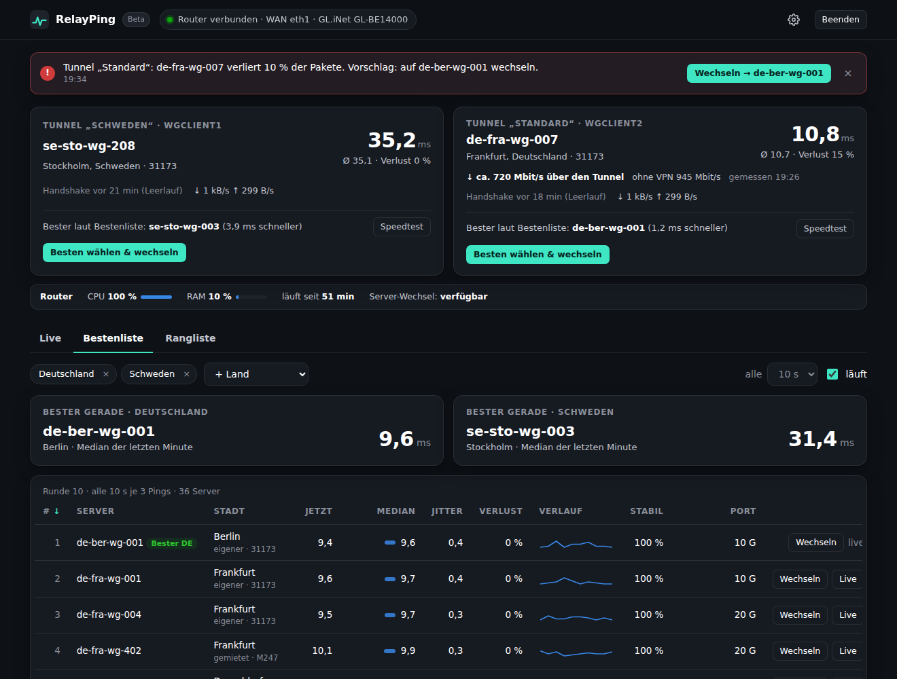
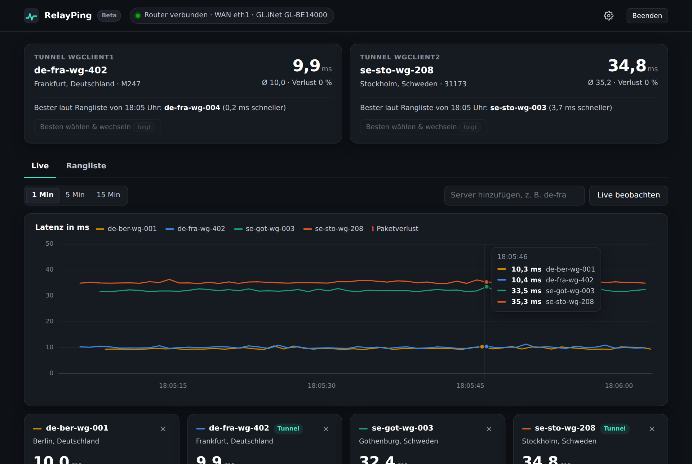
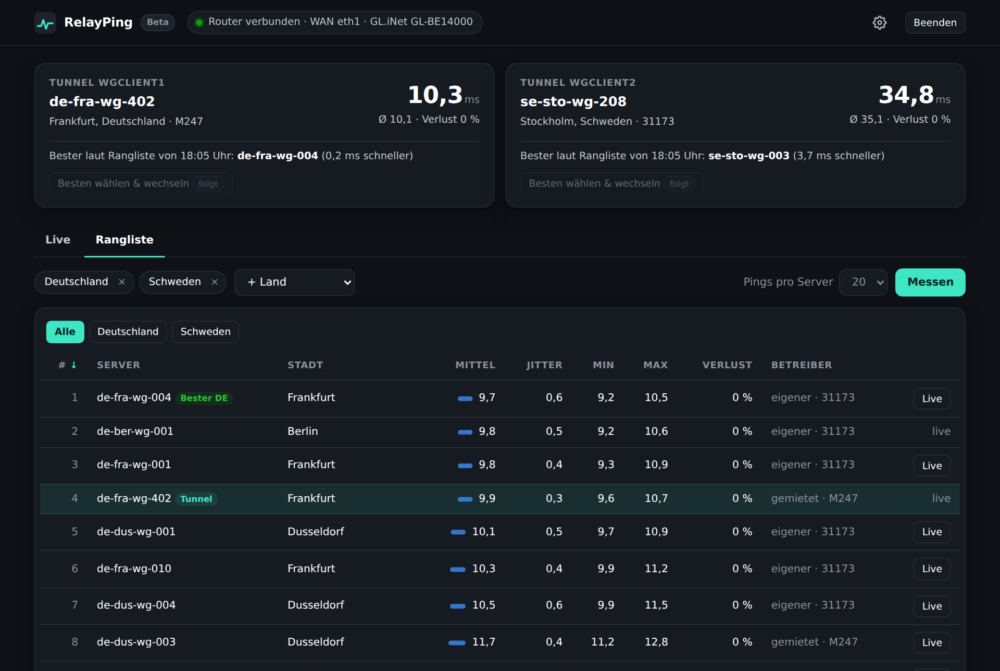

# RelayPing

**Live-Latenz zu Mullvad-WireGuard-Servern – gemessen von deinem GL.iNet-Router aus.**

RelayPing ist ein kleines, portables Windows-Tool: eine einzige `.exe`, keine Installation. Es zeigt dir in Echtzeit, wie schnell die Mullvad-Server von deinem Anschluss aus erreichbar sind, hält eine laufend aktualisierte Bestenliste ganzer Länder und stellt einen Tunnel **auf Knopfdruck** auf einen besseren Server um.

> **Vorabversion (Beta).** Die Messungen laufen auf einem echten Flint 4 (GL-BE14000). Der Server-Wechsel über die GL.iNet-Schnittstelle ist bisher nur gegen einen nachgebauten Router getestet. Rückmeldungen über die Issues sind willkommen.
>
> **Inoffizielles Community-Tool.** RelayPing steht in keiner Verbindung zu Mullvad VPN AB oder GL.iNet. „Mullvad“ und „GL.iNet“ sind Marken ihrer jeweiligen Inhaber.



## Warum am Router messen?

Wenn dein VPN auf dem Router läuft, geht jeder Ping vom PC erst durch den aktiven Tunnel. Du würdest also messen, wie schnell *der VPN-Server* die anderen Server erreicht, nicht dein Anschluss. RelayPing lässt deshalb den Router selbst pingen, über die WAN-Leitung am Tunnel vorbei. Der PC zeigt nur an.

## Funktionen

- **Tunnel-Übersicht:** erkennt die aktiven WireGuard-Tunnel des Routers (mit ihren Namen aus dem GL.iNet-Panel) und zeigt Live-Latenz, Handshake-Alter und Datenrate.
- **Bestenliste:** pingt alle Server der gewählten Länder dauerhaft (Standard: alle 10 s je 3 Pings) und sortiert laufend nach Verlust und Median der letzten Minute. Mit Verlaufskurve, Stabilitätswert, Portgeschwindigkeit und dem aktuell besten Server je Land.
- **Server wechseln per Knopf:** „Besten wählen & wechseln“ am Tunnel oder „Wechseln“ in jeder Zeile. RelayPing stellt den Tunnel über die GL.iNet-Schnittstelle um, wartet auf den WireGuard-Handshake und stellt nach 35 Sekunden ohne Verbindung automatisch den vorherigen Server wieder ein. Gewechselt wird nur innerhalb desselben Landes und nur auf Knopfdruck, nie automatisch.
- **Warnungen:** verliert der Server eines Tunnels Pakete oder ist er deutlich langsamer als der beste im Land, erscheint ein Hinweis mit Wechsel-Vorschlag, auch als Windows-Benachrichtigung. Schwellen einstellbar.
- **Speedtest:** lädt vom Router aus ca. 10 Sekunden lang durch den Tunnel herunter (Cloudflare-Testdatei, 4 Verbindungen) und zum Vergleich ohne VPN. Ergebnis ist ein Richtwert, die Router-CPU begrenzt mit. Verbraucht bei Gigabit bis zu etwa 2,5 GB.
- **Live-Graphen:** bis zu 8 Server gleichzeitig, Zeitfenster 1, 5 oder 15 Minuten, lineare oder logarithmische Achse (Automatik bei Ausreißern), Favoriten für Server-Gruppen.
- **Rangliste:** misst alle Server der gewählten Länder gründlich (Standard: 20 Pings pro Server), auf Wunsch automatisch im Hintergrund. Aus Ranglisten und Bestenliste entsteht der **Stabilitätswert**: Anteil der Messungen der letzten 7 Tage, in denen ein Server ohne Verlust höchstens 3 ms hinter dem besten lag.
- **Router-Zustand:** CPU, RAM, Temperatur, Laufzeit.
- **Taskleiste:** RelayPing läuft unsichtbar im Infobereich, auf Wunsch mit Windows-Start. Ein zweiter Start öffnet nur die Oberfläche.
- **Deutsch und Englisch**, umschaltbar in den Einstellungen.
- **Verlauf als CSV:** Minutenwerte, Ranglisten, Wechsel und Speedtests im deutschen Excel-Format (Semikolon, Dezimalkomma).
- **Wiederverbindung:** fällt der Router weg, verbindet sich RelayPing von selbst neu.





## Voraussetzungen

- Windows 10 oder 11, 64 Bit
- Ein GL.iNet-Router mit Firmware 4.x (entwickelt für den Flint 4 / GL-BE14000). SSH muss aktiv sein, das ist im Heimnetz Standard.
- Auf dem Router werden die üblichen OpenWrt-Werkzeuge genutzt: `ping` (BusyBox), `ubus`, `jsonfilter`, `wg` für die Tunnel-Erkennung und `curl` für Server-Wechsel und Speedtest
- Mullvad-WireGuard-Tunnel auf dem Router. Für Live-Graphen und Rangliste ist das nicht nötig, nur für die Tunnel-Übersicht.

## Download und Start

1. Unter **[Releases](../../releases)** die neueste `RelayPing.exe` herunterladen. Die zugehörige `.sha256`-Datei enthält die Prüfsumme.
2. Doppelklick. Weil die Datei nicht signiert ist, zeigt Windows SmartScreen eine Warnung: **„Weitere Informationen“ → „Trotzdem ausführen“**.
3. Der Browser öffnet sich. Gib **einmal** das Passwort des GL.iNet-Admin-Panels ein.

Bei dieser ersten Anmeldung erzeugt RelayPing einen eigenen SSH-Schlüssel (RSA 3072) und hinterlegt ihn auf dem Router in `/etc/dropbear/authorized_keys`, markiert mit `relayping`. Das Passwort wird nicht gespeichert. Ab dann verbindet sich das Tool bei jedem Start automatisch.

RelayPing sitzt danach als Symbol im Infobereich der Taskleiste. Linksklick öffnet die Oberfläche, Rechtsklick zeigt **Öffnen**, **Mit Windows starten** und **Beenden**. Das Browserfenster darf geschlossen werden, die Messungen laufen weiter.

## Dateien neben der .exe

RelayPing ist portabel und legt alles in den eigenen Ordner. Ist dieser schreibgeschützt, landet es unter `%APPDATA%\RelayPing`.

| Datei | Inhalt |
|---|---|
| `relayping.json` | Einstellungen, Router-Adresse, gemerkter Router-Fingerabdruck |
| `relayping.key` | **dein privater SSH-Schlüssel für den Router**, wie ein Passwort behandeln |
| `relayping-ui.key` | Zugangsschlüssel für die Oberfläche im Browser |
| `relayping-server.json` | Mullvad-Serverliste, wird höchstens einmal am Tag neu geladen |
| `relayping-verlauf.json` | Messwerte der letzten 7 Tage für den Stabilitätswert |
| `relayping-speed.json` | letztes Speedtest-Ergebnis je Server |
| `relayping.log` | Programmprotokoll |
| `verlauf/` | CSV-Verlauf (`live-minutenwerte.csv`, `ranglisten.csv`, `wechsel.csv`, `speedtest.csv`) |

## Sicherheit

- Die Oberfläche lauscht nur auf `127.0.0.1`. Zugriffe brauchen ein Cookie mit dem Schlüssel aus `relayping-ui.key`. Anfragen mit fremdem Host-Header und Cross-Site-Anfragen werden abgewiesen.
- Den Router-Fingerabdruck merkt sich RelayPing bei der ersten Verbindung (Trust on first use). Ändert er sich später, verweigert das Tool die Verbindung. Nach einem Router-Reset gibt es in den Einstellungen **„Router-Zugang zurücksetzen“**.
- An den Router gehen nur feste Befehle. Server-IPs und Schnittstellennamen werden vorher streng geprüft.
- Für den Wechsel ruft RelayPing auf dem Router die lokale GL.iNet-Schnittstelle auf (`vpn-client.set_tunnel`), genau wie das Admin-Panel. Es wird nur der Server getauscht, Domainliste und Regeln des Tunnels bleiben unverändert. Jeder Wechsel steht in `verlauf/wechsel.csv`.
- Schlüssel auf dem Router wieder entfernen (per SSH):
  ```sh
  sed -i '/ relayping$/d' /etc/dropbear/authorized_keys
  ```

## Grenzen

- Ein Ping misst Strecke und Paketverlust, **nicht die Auslastung** eines Servers. Mullvad veröffentlicht keine Auslastung. Die angezeigte Portgeschwindigkeit (10 oder 20 Gbit/s) ist der Anschluss des Servers, nicht deine Geschwindigkeit.
- Der Speedtest misst nur den Server, über den ein Tunnel gerade läuft. Um einen anderen zu testen, erst wechseln.
- Server-Wechsel geht nur innerhalb des Landes, das der Tunnel schon nutzt, und nur auf Server, für die im GL.iNet-Panel ein Profil existiert (bei Mullvad über die Kontoanmeldung normalerweise alle). Ob die lokale GL.iNet-Schnittstelle auf deiner Firmware erreichbar ist, prüft RelayPing beim Verbinden und zeigt es unter „Server-Wechsel“ an.
- Die Serverliste kommt aus der öffentlichen Mullvad-API (`api.mullvad.net`).

## Selbst bauen

Benötigt Go 1.24 oder neuer.

```sh
go test ./...
GOOS=windows GOARCH=amd64 CGO_ENABLED=0 go build -trimpath -ldflags "-s -w -H windowsgui" -o RelayPing.exe .
```

Das Programmsymbol und die Versionsinfos stecken in `rsrc_windows_amd64.syso`, erzeugt aus `app.rc` und `icon.ico`. Releases baut eine GitHub Action automatisch, sobald ein Release veröffentlicht wird.

## Lizenz

MIT, siehe [LICENSE](LICENSE). Enthaltene Fremdbibliotheken: siehe [THIRD_PARTY_NOTICES.md](THIRD_PARTY_NOTICES.md).

---

### English summary

RelayPing is a portable Windows tool (single `.exe`) that shows **live latency, jitter and packet loss to Mullvad WireGuard servers, measured from your GL.iNet router** over the WAN link, bypassing the tunnel. That matters because pinging from a PC behind a VPN router would only measure the path through the active tunnel. It detects the router's active WireGuard tunnels, keeps a live leaderboard of whole countries with a 7-day stability score, plots up to 8 servers live (linear or log axis), warns when a tunnel degrades, runs a speed test through the tunnel and **switches a tunnel to a better server at the push of a button** (same country only, with automatic rollback if the new server does not handshake within 35 s). It runs in the Windows tray and can start with Windows. On first start it asks once for the router's admin password, installs its own SSH key and never stores the password. UI in German and English. **Beta – measuring is tested on a real Flint 4; switching only against a simulated router so far.** Unofficial, not affiliated with Mullvad VPN AB or GL.iNet. MIT licensed.
